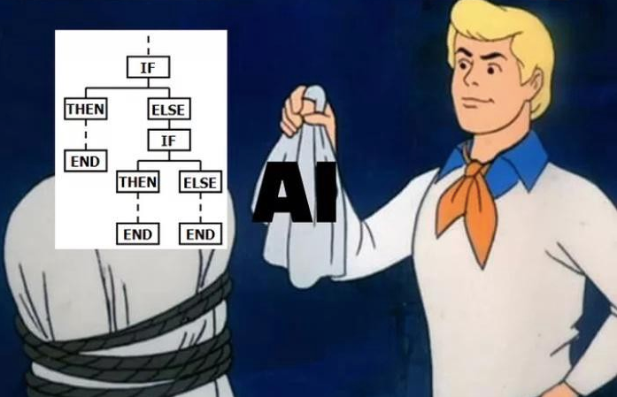

# Conditionals in JS

These statements are used to perform actions which are directed by conditions

Conditional statements in programming come in four types: 

- 🌟 `if`: Used for basic conditional checks.
- 🌈 `else`: Provides an alternative action when the `if` condition is false.
- 💡 `else if`: Allows you to check additional conditions if the initial `if` condition is false.
- 🔄 `switch`: Used for multi-way branching based on a value.

Feel free to use this in your Markdown documents!

## if condition

```
if (condition) {
  //  actions to be performed
}
```

## else condition

```
if (condition) {
  //  if condition is matched this will run
} else {
  //  else this would run
}
```

## else if

There can be  multiple use cases !
```
if (condition1) {
  //  check for this condition
} else if (condition2) {
  //  check for another condition
} else {
  // last resort
}
```
## Example

 <iframe
      id="inlineFrameExample"
      title="Javascript"
      frameborder="0" 
      scrolling="no"
      height="400"
      width="700"
      src="https://stackblitz.com/edit/js-dfhq4e?ctl=1&embed=1&file=index.js&hideExplorer=1"
      >
</iframe>

## Switch

Switch is another way of writing conditional statements

```
switch(expression) {
  case x:
    // case 1
    break;
  case y:
    // case 2
    break;
  case z:
    // case 3
    break;
  default:
    // case default
}
```
:::note

You can read more about comparison on [Strict Comparison](https://www.freecodecamp.org/news/loose-vs-strict-equality-in-javascript/)

:::

## Artificial Intelligence

🎉 Congratulations! 🎉 You have created your first AI 🤖 with if else! 😄👏


